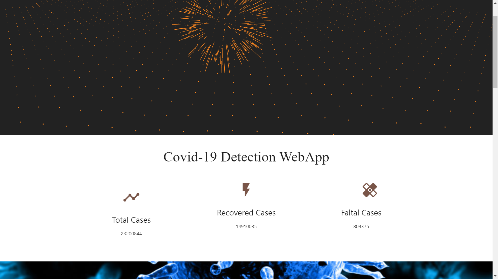
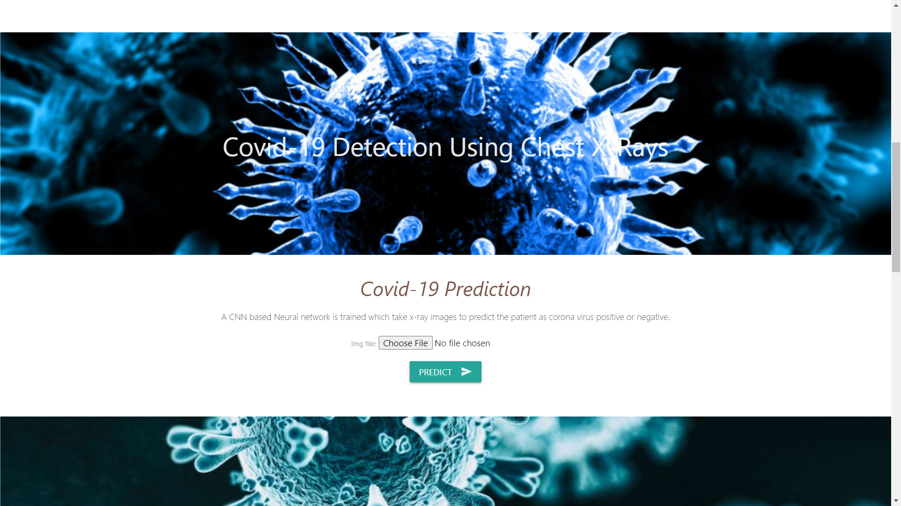
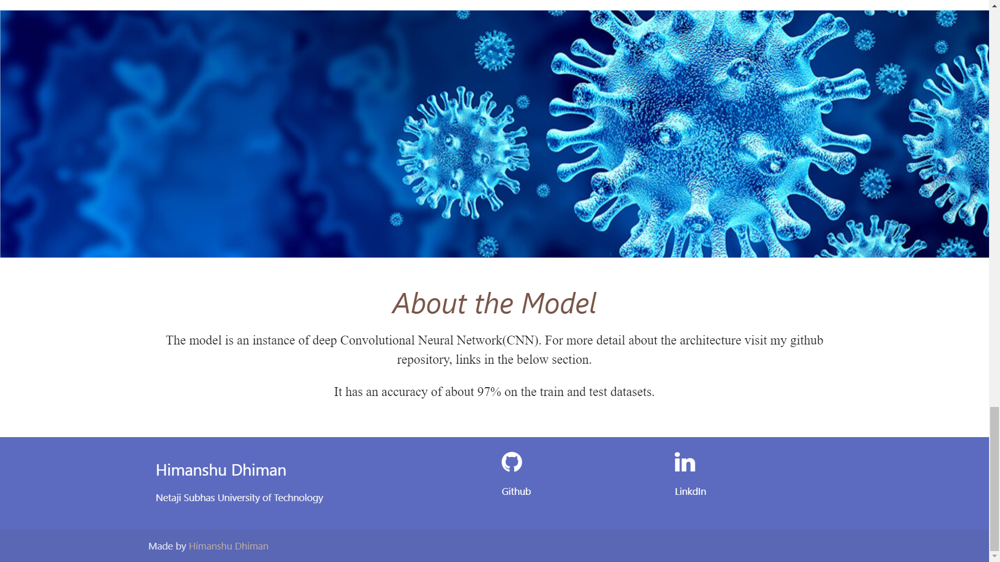
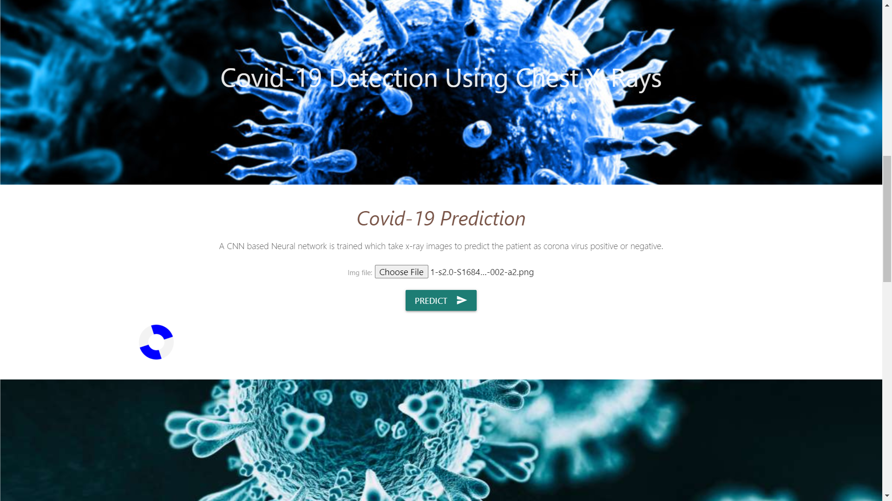
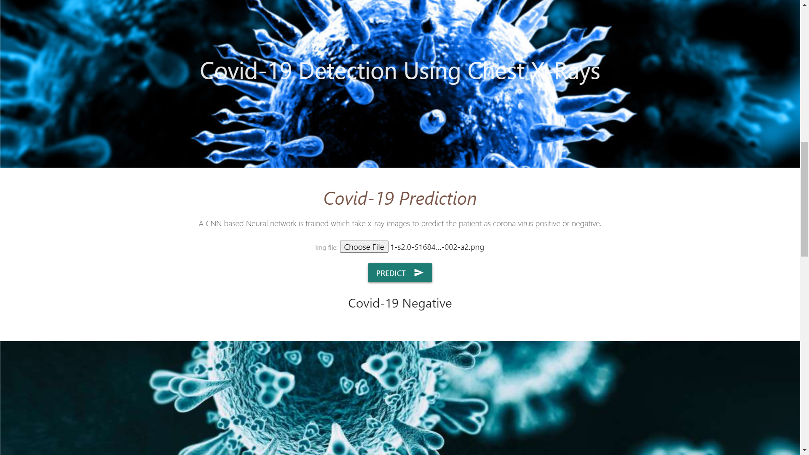
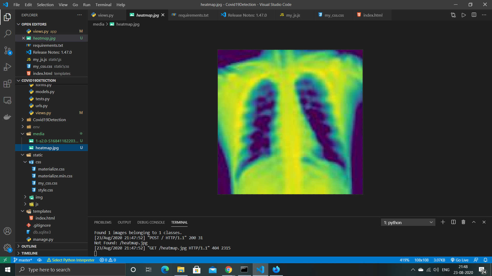

# Covid-19-Detection

### Requirements
      - Python 3 or Above

> On Windows

      $ git clone https://github.com/himdhiman/Covid-19-Detection.git
      $ cd Covid-19-Detection
      $ pip install virtualenv env
      $ env\Scripts\activate
      $ pip install -r requirements.txt
      $ python manange.py runserver

> On Mac / Linux

      $ git clone https://github.com/himdhiman/Covid-19-Detection.git
      $ cd Covid-19-Detection
      $ pip install virtualenv env
      $ source env/bin/activate
      $ pip install -r requirements.txt
      $ python manange.py runserver
      
      

